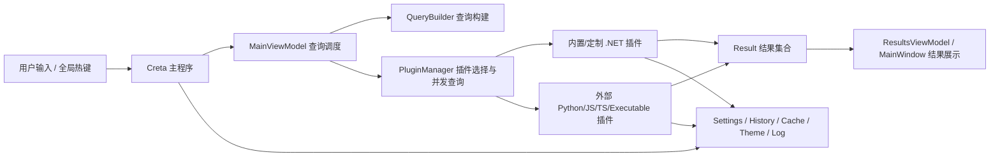

# Creta 设计文档

本文档基于当前仓库代码整理，目标是从实现角度说明项目的整体设计、核心流程、模块边界和本仓库的定制能力，便于后续维护、二次开发与问题排查。

## 1. 文档范围

- 说明当前仓库的整体架构，而不是上游官网的通用介绍。
- 说明主程序、核心库、基础设施层、插件接口层、内置插件与本仓库定制插件之间的关系。
- 说明启动流程、查询流程、插件生命周期、数据存储方式和扩展点。
- 说明当前实现中的关键约束、已知边界和后续演进方向。

## 2. 项目定位

- `Creta` 是一个基于 Windows 的快速启动器与统一搜索入口。
- 用户通过全局热键呼出主窗口，在同一个输入框内完成应用搜索、文件搜索、系统命令、网页搜索、插件命令和自定义工作流。
- 系统能力主要由插件提供，主程序负责窗口、输入、查询调度、结果展示、设置管理与插件宿主。
- 本仓库不只是上游基础功能，还额外加入了本地 Prompt 检索、Chrome 标签页检索、Quick Note 轻量笔记等定制插件。

## 3. 技术栈与运行环境

- 开发语言：`C#`
- UI 框架：`WPF`
- 目标框架：
  - 主程序 `Creta`：`net9.0-windows10.0.19041.0`
  - 核心库与基础设施库：`net9.0-windows`
- 依赖注入：`Microsoft.Extensions.Hosting` + `Microsoft.Extensions.DependencyInjection`
- MVVM：`CommunityToolkit.Mvvm`
- 主题与现代控件：`iNKORE.UI.WPF.Modern`
- 插件通信与宿主支持：
  - .NET 插件直接加载程序集
  - Python / JavaScript / TypeScript / Executable 插件通过对应运行环境或进程方式接入
- 测试框架：`NUnit`

## 4. 解决方案结构

- `Creta`
  - 主程序与 WPF 界面层。
  - 负责应用启动、主窗口、设置窗口、欢迎页、主题切换、托盘、热键、预览、通知与主查询入口。
- `Creta.Core`
  - 核心业务层。
  - 负责插件发现、插件装载、插件初始化、插件生命周期管理、外部插件环境、查询构建与插件侧调用调度。
- `Creta.Infrastructure`
  - 通用基础设施层。
  - 负责常量、日志、字符串匹配、Win32 能力、热键、图片加载、存储封装、用户设置模型等。
- `Flow.Launcher.Plugin`
  - 插件 SDK 层。
  - 负责定义 `IPlugin`、`IPublicAPI`、`IContextMenu`、`ISettingProvider`、`IPluginI18n` 等插件接口与共享模型。
- `Plugins/*`
  - 各个内置或定制插件项目。
  - 每个插件都通过 `plugin.json` 描述元数据，通过单独程序集接入主程序。
- `Creta.Test`
  - 单元测试项目。
  - 覆盖查询构建、字符串匹配、插件行为等核心逻辑。
- `docs`
  - 使用说明、设计方案、部署说明与优化记录。
- `Scripts`
  - 打包、发布、部署辅助脚本。
- `Output`
  - 调试或发布构建输出目录。

## 5. 总体架构

## 6. 启动设计

### 6.1 启动入口

- 应用入口位于 `Creta/App.xaml.cs` 的 `Main()`。
- 启动时首先通过 `CretaJsonStorage<Settings>` 加载用户设置。
- 在创建 `App` 之前先初始化系统语言，并根据设置切换当前文化信息。
- 应用通过 `SingleInstance<App>.InitializeAsFirstInstance()` 保证单实例运行。

### 6.2 依赖注入初始化

- `App` 构造函数中使用 `Host.CreateDefaultBuilder()` 建立依赖注入容器。
- 主要注册内容包括：
  - `Settings`
  - `Updater`
  - `Portable`
  - `StringMatcher`
  - `Internationalization`
  - `IPublicAPI`
  - `Theme`
  - `MainViewModel`
  - 各设置页与辅助窗口的 ViewModel
- `MainViewModel` 使用单例，原因是应用只有一个主窗口。
- 设置页 ViewModel 多数使用瞬态实例，避免窗口关闭后保留陈旧状态。

### 6.3 OnStartup 关键步骤

- 配置日志级别。
- 根据设置更新字体、主题等动态资源。
- 初始化通知系统。
- 在创建所有窗口之前启用 Win32 深浅色支持。
- 初始化国际化资源。
- 处理便携模式相关清理。
- 注册 AppDomain、Dispatcher、TaskScheduler 级别的异常处理。
- 并行预热图片加载器。
- 配置 HTTP 代理。
- 更新插件清单。
- 创建 `MainWindow`。
- 初始化 Dialog Jump。
- 初始化全局热键映射器。
- 应用主题。
- 注册退出事件、自动启动、自动更新等逻辑。
- 异步加载并初始化插件。

### 6.4 插件启动阶段

- `PluginManager.LoadPlugins()` 先扫描插件目录并加载插件元数据。
- `PluginManager.InitializePluginsAsync()` 再逐个调用插件 `InitAsync()`。
- 插件初始化后会继续完成：
  - 注册结果更新事件
  - 更新插件多语言元数据
  - 接入 Dialog Jump
  - 分类到 Home、Context Menu、翻译、外部预览等列表
- 插件初始化完成后，主界面会刷新历史结果与主页结果。

## 7. 主窗口与界面设计

### 7.1 MainWindow 职责

- `Creta/MainWindow.xaml.cs` 负责主窗口行为层逻辑。
- 主要职责包括：
  - 绑定 `MainViewModel`
  - 初始化窗口位置与尺寸
  - 管理托盘图标和右键菜单
  - 管理窗口显示/隐藏
  - 处理首次启动欢迎页和版本更新提示
  - 管理输入框焦点、动画、音效、预览区域、时钟面板
  - 响应设置变化并刷新界面

### 7.2 MainViewModel 职责

- `MainViewModel` 是主交互流程的核心协调器。
- 主要职责包括：
  - 维护当前查询文本与结果状态
  - 管理主结果、上下文菜单结果、历史结果三类结果视图
  - 构建查询对象
  - 调度插件并发查询
  - 合并、排序、刷新查询结果
  - 管理历史记录、TopMost 记录、用户选择记录
  - 控制预览、进度条、主页、Dialog Jump、复制后回焦等行为

### 7.3 相关辅助窗口

- `WelcomeWindow`
  - 首次启动时展示欢迎信息。
- `SettingWindow`
  - 承载插件、主题、热键、代理、关于等设置页。
- `PluginSettingsWindow`
  - 用于单独打开某个插件的设置界面。
- `ReleaseNotesWindow`
  - 展示版本更新说明。

## 8. 查询设计

### 8.1 查询入口

- 用户在输入框中键入内容后，`MainViewModel.Query()` 会根据当前视图状态决定：
  - 查询普通结果
  - 查询上下文菜单
  - 查询历史记录
- 普通结果最终进入 `QueryResultsAsync()`。

### 8.2 查询构建

- `ConstructQueryAsync()` 负责把原始输入转换为统一的 `Query` 对象。
- 构建过程包括：
  - 应用自定义快捷词展开（完整查询等于捷径键，或查询中的 `@键`；默认内置 `chatgpt网页` → `https://chatgpt.com`，`chatgpt` 留给桌面 App）
  - 应用内建快捷词展开
  - 调用 `QueryBuilder.Build()` 生成结构化查询
- `QueryBuilder` 将查询分为三类：
  - 主页查询：输入为空
  - 指定插件查询：首个词命中某个动作关键字
  - 全局查询：未命中动作关键字，由全局插件共同响应

### 8.3 查询调度

- 每次新查询开始前，旧查询会通过 `CancellationTokenSource` 取消。
- 主流程会根据查询类型选择插件集合：
  - 主页查询：`PluginManager.ValidPluginsForHomeQuery()`
  - 普通查询：`PluginManager.ValidPluginsForQuery()`
  - Dialog Jump 查询：仅允许支持该能力的插件
- 当且仅当命中单个动作关键字插件时，输入框左侧展示该插件图标。

### 8.4 并发执行

- 每个插件查询都作为单独任务执行。
- 非主页查询支持插件级搜索延迟：
  - 优先使用插件自定义 `SearchDelayTime`
  - 否则回退到全局设置
- 若单次查询耗时超过 200ms，界面会显示进度条。

### 8.5 结果更新机制

- 查询任务结束后，结果会被深拷贝并写入结果更新通道。
- `MainViewModel.RegisterViewUpdate()` 中通过 `Channel<ResultsForUpdate>` 异步消费结果。
- 这样做的目的包括：
  - 避免插件线程直接操作 UI 状态
  - 支持多插件结果分批进入界面
  - 在快速输入时利用取消令牌淘汰过期结果

### 8.6 增量结果更新

- 支持 `IResultUpdated` 的插件可以在首轮结果后继续增量推送。
- `MainViewModel.RegisterResultsUpdatedEvent()` 会把这类更新重新投递到结果通道。
- 这使得插件既能快速返回初步结果，也能继续补充异步结果。

### 8.7 主页、上下文菜单、历史的区别

- 主页
  - 输入为空时触发。
  - 可展示支持 `IAsyncHomeQuery` 的插件结果，以及历史记录结果。
- 上下文菜单
  - 针对当前选中结果生成操作项。
  - 除插件自定义菜单外，还会补充置顶、插件设置、插件信息等通用菜单。
- 历史
  - 展示最近执行过的查询或结果。
  - 与主页显示逻辑相互配合。

## 9. 插件系统设计

### 9.1 插件元数据

- 每个插件目录下必须存在 `plugin.json`。
- 关键字段包括：
  - `ID`
  - `Name`
  - `Description`
  - `Version`
  - `Language`
  - `ExecuteFileName`
  - `ActionKeyword` 或 `ActionKeywords`
  - `IcoPath`
- 主程序会把相对 `IcoPath` 和 `ExecuteFileName` 自动解析为插件目录下的绝对路径。

### 9.2 插件目录

- 预装插件目录：`Constant.PreinstalledDirectory`，即程序目录下的 `Plugins`
- 用户插件目录：`DataLocation.PluginsDirectory`
- `PluginManager.Directories` 会同时扫描这两类目录。

### 9.3 插件发现与去重

- `PluginConfig.Parse()` 遍历插件目录，读取 `plugin.json`。
- 若目录中存在 `NeedDelete.txt`，启动时会尝试删除该插件目录。
- 同一插件 `ID` 出现多个版本时，仅保留版本最高者，其余记为重复插件并写日志。

### 9.4 插件加载类型

- `PluginsLoader` 当前支持以下插件类型：
  - .NET 插件
  - Python 插件
  - Python V2 插件
  - JavaScript 插件
  - JavaScript V2 插件
  - TypeScript 插件
  - TypeScript V2 插件
  - Executable 插件
  - Executable V2 插件
- .NET 插件通过 `PluginAssemblyLoader` 反射装载并实例化实现 `IAsyncPlugin` 的类型。
- 非 .NET 插件通过对应环境对象完成运行时准备和宿主包装。

### 9.5 插件生命周期

- 发现：读取元数据并构建 `PluginPair`
- 装载：创建插件实例
- 初始化：调用 `InitAsync`
- 查询：执行 `Query` / `QueryAsync` / HomeQuery / DialogJump
- 保存：应用退出或主动保存时调用 `ISavable.Save`
- 重载：通过 `IReloadable` 或 `IAsyncReloadable` 刷新插件内存数据
- 释放：退出时调用 `Dispose` 或 `DisposeAsync`

### 9.6 插件能力接口

- `IPlugin`
  - 最基础的查询插件接口。
- `ISettingProvider`
  - 为插件设置页提供 WPF 控件。
- `IContextMenu`
  - 为某个查询结果提供右键/上下文菜单项。
- `IPluginI18n`
  - 提供插件名称和描述的多语言文本。
- `IAsyncHomeQuery`
  - 允许插件参与主页结果。
- `IResultUpdated`
  - 允许插件异步增量更新结果。
- `IAsyncExternalPreview`
  - 允许插件提供外部预览能力。
- `IAsyncDialogJump`
  - 允许插件参与 Dialog Jump。

### 9.7 插件公共 API

- 主程序通过 `PublicAPIInstance` 实现 `IPublicAPI`，向插件开放统一能力。
- 典型能力包括：
  - 修改查询文本
  - 显示通知或消息框
  - 复制到剪贴板
  - 打开设置页
  - 打开目录或 URL
  - 访问字符串模糊匹配
  - 读写插件设置 JSON
  - 触发重新查询
  - 注册全局键盘监听
  - HTTP 下载与请求
  - 插件安装、卸载、动作关键字管理

### 9.8 插件故障处理

- 插件初始化失败时，会记录日志并自动标记为禁用。
- 若插件已显式禁用，则失败后只记日志，不重复打扰用户。
- 插件初始化失败后仍保留在插件列表中，便于后续管理、移除或修复。

## 10. 数据存储设计

### 10.1 数据目录选择

- `DataLocation` 负责统一决定用户数据目录。
- 优先使用便携模式目录：`<ProgramDirectory>\UserData`
- 若不存在有效便携目录，则使用漫游目录：`%APPDATA%\Creta`

### 10.2 目录划分

- `Settings`
  - 全局设置与插件设置
- `Cache`
  - 缓存数据
- `Logs`
  - 日志
- `Plugins`
  - 用户安装插件
- `Themes`
  - 主题文件
- `Settings\Plugins`
  - 插件设置目录
- `Cache\Plugins`
  - 插件缓存目录

### 10.3 JSON 存储实现

- `JsonStorage<T>` 是通用 JSON 序列化存储类。
- 特点包括：
  - 自动创建目录
  - 支持默认值回退
  - 支持 `.tmp` 临时文件写入
  - 支持 `.bak` 备份恢复
  - 使用原子替换降低设置文件损坏风险
- `CretaJsonStorage<T>` 是面向主程序设置体系的封装，负责结合 `DataLocation` 自动确定文件位置。

### 10.4 典型持久化对象

- `Settings`
  - 应用全局配置
- `History`
  - 最近打开历史
- `UserSelectedRecord`
  - 用户选择偏好
- `TopMostRecord`
  - 查询结果置顶记录
- 各插件自定义设置
  - 通过 `IPublicAPI.LoadSettingJsonStorage<T>()` 持久化

## 11. 匹配与排序设计

### 11.1 字符串匹配

- 全局字符串匹配能力由 `StringMatcher` 提供。
- 插件可通过 `IPublicAPI.FuzzySearch()` 复用这一套能力。
- 主程序和插件都以此为基础做进一步加权。

### 11.2 主程序结果排序思路

- 插件结果会携带原始 `Score`。
- 主程序在展示阶段还会综合：
  - 插件优先级
  - 用户历史选择
  - TopMost 记录
  - 当前查询上下文
- 因此结果最终顺序不完全等于插件原始返回顺序。

### 11.3 定制插件排序思路

- `Local Prompt Search`
  - 叠加标题、关键字、标签、描述的模糊分。
  - 对标题精确命中、前缀命中、收藏、最近使用给予额外加权。
- `Quick Note`
  - 基于 `NoteSearchScorer` 综合内容、标签、更新时间、置顶状态排序。
- `Browser Tabs`
  - 优先匹配标签标题，未达到阈值时回退到 URL 匹配。

## 12. 主题、图标与预览设计

- 主题由 `Theme` 服务控制，启动后统一应用。
- 颜色模式支持 `Light`、`Dark`、`System`。
- 主窗口支持动画、音效、阴影、Backdrop、时钟与日期面板。
- 结果图标由插件 `IcoPath` 提供，若结果未提供 badge，则回退为插件图标。
- 预览支持两类模式：
  - 内部预览
  - 外部预览插件扩展
- `F1` 相关热键和永久预览设置由 `MainViewModel` 与 `ResultsViewModel` 协同控制。

## 13. 典型内置插件概览

当前解决方案中可见的核心插件包括：

- `Program`
  - 程序与应用入口搜索。
- `Explorer`
  - 文件系统、快速访问、预览与资源管理器相关能力。
- `Shell`
  - Shell 命令执行。
- `Sys`
  - 系统命令。
- `Url`
  - URL 识别与打开。
- `WebSearch`
  - 网页搜索。
- `BrowserBookmark`
  - 浏览器书签搜索。
- `WindowsSettings`
  - Windows 设置与控制面板项搜索。
- `Calculator`
  - 计算器能力。
- `PluginsManager`
  - 插件管理与插件商店。
- `ProcessKiller`
  - 进程管理。
- `PluginIndicator`
  - 插件状态指示。

## 14. 本仓库定制插件设计

### 14.1 Local Prompt Search

- 插件目录：`Plugins/Creta.Plugin.BrowserBookmark`
- 动作关键字：`pt`
- 目标：
  - 在本地维护 Prompt 模板库
  - 在 Creta 中快速检索、复制并可选回焦粘贴
- 核心设计：
  - `PromptRepository` 优先加载配置指定文件，否则加载插件目录下的 `prompts.json`，再回退到 `prompts.sample.json`
  - 首页可展示最近使用模板、收藏模板和重载入口
  - 支持上下文菜单：复制正文、复制标题、收藏切换、打开模板文件位置、清空最近使用
  - 若当前使用的是真实 `prompts.json`，可把收藏状态回写到文件中
- 适用场景：
  - AI Prompt 模板复用
  - 常见命令片段、写作模板、编码提示词的本机管理

### 14.2 Browser Tabs

- 插件目录：`Plugins/Creta.Plugin.BrowserBookmark`
- 动作关键字：`tab`
- 目标：
  - 搜索已打开的 Chrome 标签页并直接切换
- 核心设计：
  - `ChromeTabLoader` 通过 UI Automation 遍历 `Chrome_WidgetWin_1` 窗口
  - 结合最近会话 URL 补充标签页地址信息
  - 查询时先匹配标题，不足时再匹配 URL
- 当前边界：
  - 目前实现聚焦 Chrome
  - 依赖 Windows UI Automation 和浏览器窗口结构，浏览器升级后可能需要适配

### 14.3 Quick Note

- 插件目录：`Plugins/Creta.Plugin.BrowserBookmark`
- 动作关键字：`n`
- 目标：
  - 提供轻量、快速、键盘友好的临时笔记能力
- 核心设计：
  - `NoteRepository` 负责 `notes.json` 的初始化、读取、保存、更新、删除与排序
  - 支持置顶、归档、标签提取、按标签过滤、按日期过滤
  - 支持主页最近笔记、浏览视图、搜索结果、编辑态结果
  - 支持独立编辑器窗口，适合多行笔记编辑
  - 支持在设置页自定义 `notes.json` 存储路径
- 数据设计：
  - 单条笔记包含 `Id`、`Content`、`CreatedAt`、`UpdatedAt`、`IsPinned`、`IsArchived`、`Tags`
- 当前价值：
  - 把“启动器输入框”直接扩展成“轻量笔记入口”
  - 与 Creta 的键盘流操作模式高度一致

## 15. 测试设计

- 测试项目位于 `Creta.Test`
- 当前可见测试覆盖方向包括：
  - `QueryBuilderTest`
  - `FuzzyMatcherTest`
  - `PluginLoadTest`
  - 各插件测试，如 `CalculatorTest`、`ExplorerTest`、`UrlPluginTest`
  - `NoteRepositoryTests`
- 说明：
  - 测试项目已显式引用 `Creta.Plugin.BrowserBookmark`，说明 Quick Note 已纳入自动化验证范围
  - 新增定制插件时，优先为仓储、排序、查询边界和视图别名增加测试

## 16. 构建与输出设计

- 主程序、核心库和基础设施库默认输出到：
  - `Output\Debug`
  - `Output\Release`
- 主程序在构建前会尝试结束正在运行的 `Creta.exe`，避免文件占用。
- 构建后会删除无关运行时目录，减小输出体积。
- 解决方案中保留了 `Scripts` 与安装包相关文件，说明仓库同时兼顾本地调试与分发打包。

## 17. 扩展与维护建议

### 17.1 适合扩展的位置

- 想扩展新业务能力：
  - 优先新增独立插件，而不是直接改主程序。
- 想调整查询语义：
  - 重点关注 `MainViewModel.ConstructQueryAsync()` 与 `QueryBuilder`。
- 想调整插件发现/装载逻辑：
  - 重点关注 `PluginConfig`、`PluginsLoader`、`PluginManager`。
- 想调整数据目录或持久化行为：
  - 重点关注 `DataLocation`、`JsonStorage<T>`、`CretaJsonStorage<T>`。
- 想调整主题或窗口行为：
  - 重点关注 `MainWindow`、`Theme`、设置页 ViewModel。

### 17.2 当前实现的维护重点

- `MainViewModel` 体量较大，承担了较多查询编排与 UI 状态职责，是后续重构的重点候选。
- 插件系统能力强，但也意味着初始化失败、跨线程更新、外部运行时环境都需要持续关注。
- 浏览器标签页这类依赖系统 UI 自动化的能力，天然比纯数据型插件更脆弱。
- 定制插件已经明显偏向“个人知识管理与效率工作流”，后续应继续保持插件内聚，避免把定制逻辑堆到主程序。

## 18. 后续演进建议

- 把 `MainViewModel` 中的查询编排、结果合并、主页逻辑进一步拆分为独立服务。
- 为 `Local Prompt Search` 增加更明确的模板分类、变量替换和多文件源支持。
- 为 `Browser Tabs` 扩展更多浏览器适配层，而不是把 Chrome 逻辑直接写死在主插件入口。
- 为 `Quick Note` 增加导出、导入、全文检索优化和更多结构化字段。
- 为定制插件补充更多自动化测试，尤其是中文场景、边界输入和持久化恢复场景。

## 19. 结论

- 当前仓库延续了 Creta 以插件为中心的宿主架构。
- 主程序负责统一的输入、显示、调度与生命周期管理，插件负责能力扩展。
- 整体设计对“快速扩展效率工具”非常友好，本仓库也已经在此基础上落地了 Prompt 检索、标签页切换和轻量笔记三类定制能力。
- 后续维护的关键不是推翻现有架构，而是在保持插件边界清晰的前提下，继续降低主 ViewModel 复杂度、提升定制插件可测试性与可演进性。
